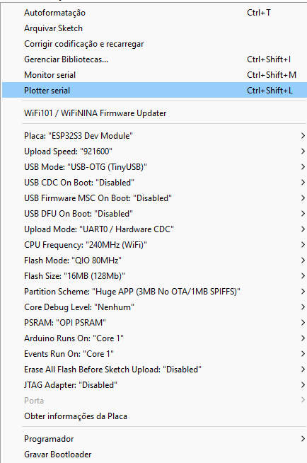
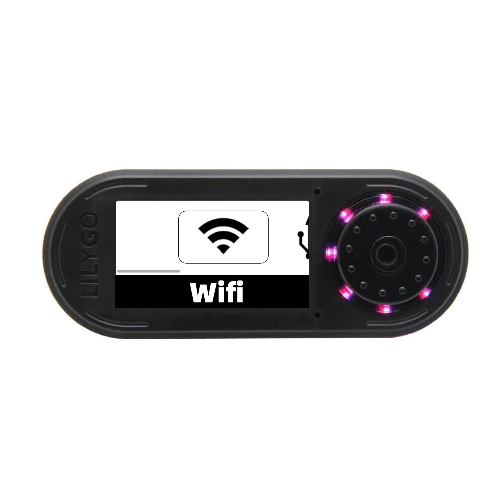
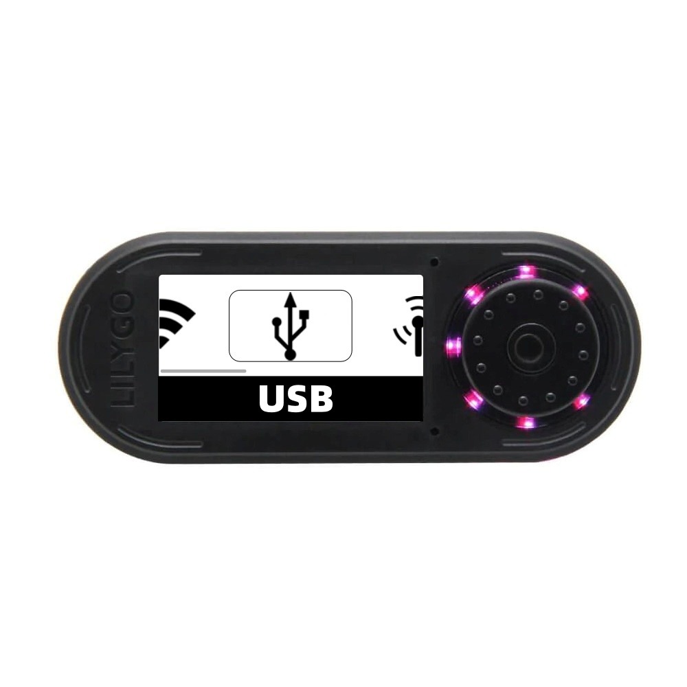
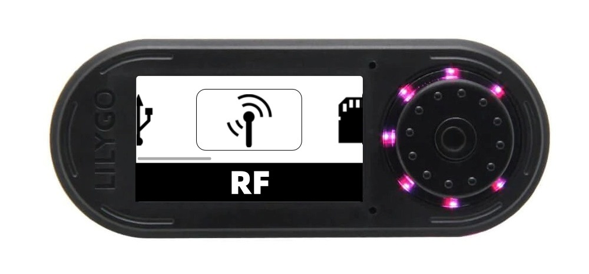
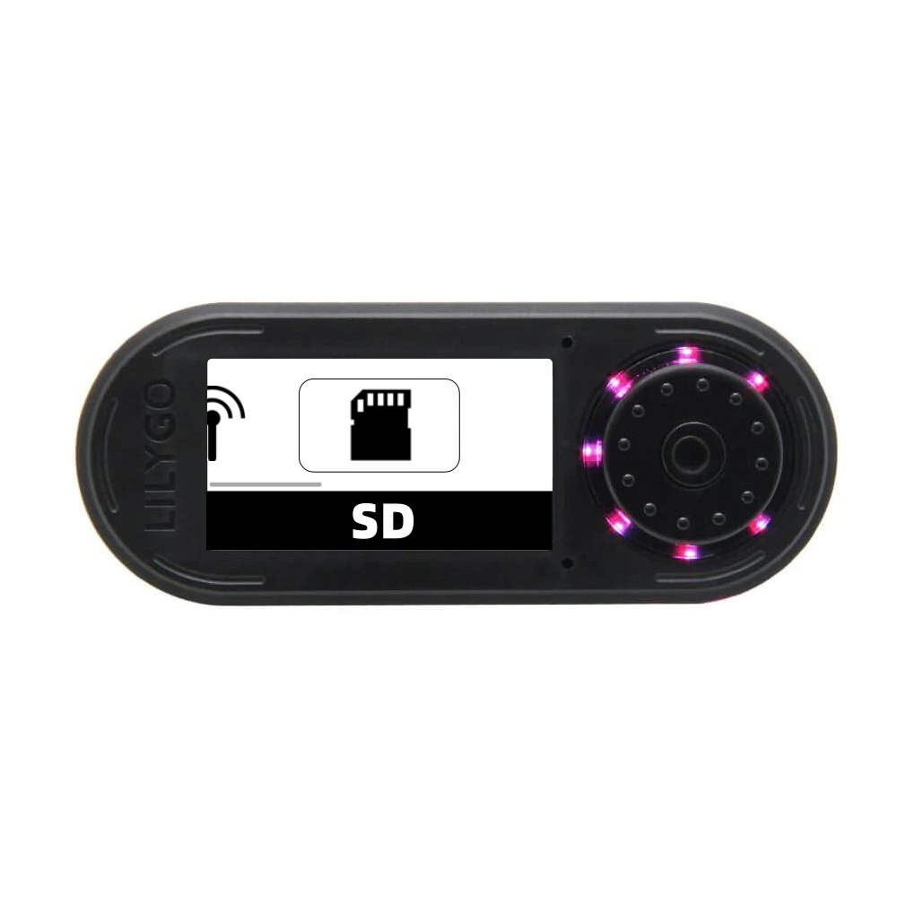

# Fapper Zero Firmware  HUN73R.0047

<strong>Firmware designed and developed by</strong> David Miguel (HUN73R.0047) (https://github.com/DMFSouza).
 

<strong>If you enjoyed this project, consider buying me a coffee:</strong>
  

  
<strong>If you're Brazilian, consider using Pix key:</strong>
  

 
</ul>
 
 

# Summary

<li><strong><a href="#installation">Installation</a></strong></li>
<ul>
<li><a href="#sdfiles">1)SD files</a></li>
<li><a href="#lib">2)Lib files</a></li>
<li><a href="#ide">3)Arduino IDE Config</a></li>

</ul>

<li><strong><a href="#wifi">Wifi Mode</a></strong></li>

<li><strong><a href="#usb">Usb Mode</a></strong></li>

<li><strong><a href="#rf">RF Mode</a></strong></li>

<li><strong><a href="#sd">SD Logs</a></strong></li>

<li><strong><a href="#bugs">Bugs</a></strong></li>

<li><strong><a href="#disclaimer">Disclaimer</a></strong></li>

# Introduction
This code aims to be an Open Source alternative to the Flipper Zero. It is based on the LilyGo ESP32 S3 hardware, T-Embed model, but it can be adapted to other ESP32 models as well. The idea is to create an affordable alternative to the Flipper, which faces various legal restrictions in many countries. And why this name? Well, because I found it amusing.

# Installation

## 1) SD Files
- Download everything from the 'SD_CARD' folder and place it on a MicroSD card.

## 2) Lib Files
- This code uses several libraries that I had to modify manually. Therefore, for its correct operation, it is necessary to use the libraries available in the Lib folder of this repository.
  
## 3) Arduino IDE Config
<li> This project uses the esp32fs plugin. Please note that Arduino IDE version 2.x does not support the esp32fs plugin. Use Arduino 1.18.x to upload resource files.</li>
 
<li> Please refer to the following figure for specific options</li>
  

  </a>

  

# Wifi Mode

  </a>

In WiFi mode, there are four modes, with only two currently functional.
  
<li><strong>Sniffer Mode:</strong> This mode allows you to connect to a Wi-Fi network and sniff its packets. The packets will be displayed on the screen, and the logs will be saved on the SD card.</li>
 
<li><strong>Deauther Mode - Under construction</strong></li>
 
<li><strong>Captive Portal Mode:</strong> Captive Portal Mode: This mode allows you to create a captive portal capable of capturing credentials. The pages can be customized; you just need to create your HTML and place it in the /captive_portals/pages folder. In the corresponding menu, a dropdown field with all available HTML pages will be presented. After selecting your preferred one and clicking Start, a local network will be created with the name of your HTML plus "Wifi-4G". For example, if your HTML file is named "lospolloshermanos", your SSID will be "lospolloshermanos-wifi-4G". Easy, right?

How do you know if you've succeeded? A calm fishing animation will be displayed. When you catch a fish, an image of the capture will be shown on your screen.

And where do the credentials go? Captured credentials are saved in the logs folder and can be accessed in the SD option of the main menu.</li>

<li><strong>Evil Twin Mode - Under construction</strong></li>

# Usb Mode

  </a>

<li>In USB mode, you can save your Rubber Ducky scripts in text format in the duckyscripts folder on the SD card. When accessing the menu, a dropdown field with all the scripts from the folder will be presented. Select the one you desire, and after connecting the hardware to the target device, click on Start, and watch the magic happen.</li>

# RF Mode

  </a>

<li><strong>Under construction</strong></li>
The RF mode is still under development, currently having only the graphical interface available.

# SD Logs

  </a>

<li>In the SD menu, you can view all the captured credentials from the captive portal in a tabular format.</li>

# Bugs

The code has some bugs, I ask for everyone's understanding as this is a preliminary version of the code, and I am updating this project only in my free time. Any help in its development or improvement will be greatly appreciated.

# Disclaimer

Fapper Zero is a basic device for professionals and cybersecurity enthusiasts.

We are not responsible for the incorrect use of Fapper Zero.

Be careful with this device and the transmission of signals. Make sure to follow the laws that apply to your country.
