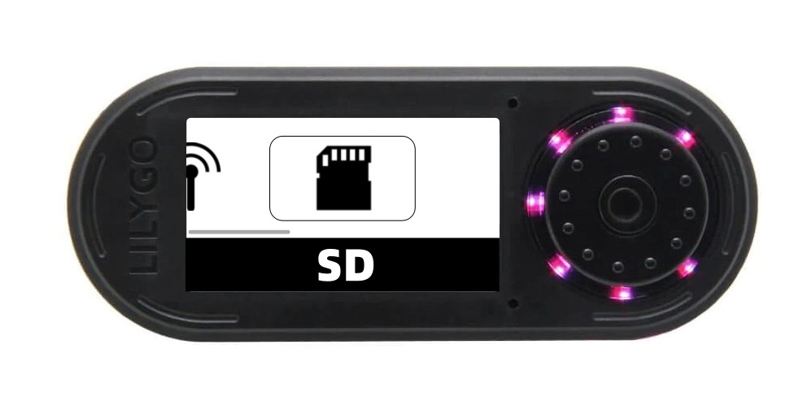

# Fapper Zero Firmware  HUN73R.0047

<strong>Firmware designed and developed by</strong> David Miguel (HUN73R.0047) (https://github.com/DMFSouza).

  
<strong>If you enjoyed this project, consider buying me a coffee:</strong>
 

 
<strong>If you're Brazilian, consider using Pix key:</strong>
 

 
</ul>
 
 

# Summary

<li><strong><a href="#installation">Installation</a></strong></li>
<ul>
<li><a href="#sdfiles">1)SD files</a></li>
<li><a href="#lib">2)Lib files</a></li>
<li><a href="#ide">3)Arduino IDE Config</a></li>

</ul>

<li><strong><a href="#wifi">Wifi Mode</a></strong></li>

<li><strong><a href="#usb">Usb Mode</a></strong></li>

<li><strong><a href="#rf">RF Mode</a></strong></li>

<li><strong><a href="#sd">SD Logs</a></strong></li>

<li><strong><a href="#disclaimer">Disclaimer</a></strong></li>

# Introduction
This firmware is an alternative to the EvilCrowRF default firmware.

This project includes all the features of the original firmware and some enhancements such as:
<ul>
<li>New modern design based on the original firmware.</li>
<li>APK for easier use on mobile devices.</li>
<li>RF wave spectrometer.</li>

<li>...</li>

</ul>

# Installation

## 1) SD Files
- Download everything from the 'SD_CARD' folder and place it on a MicroSD card.

# Wifi Mode

  </a>

# Usb Mode

  </a>

# RF Mode

  </a>

# SD Logs

  </a>

# Disclaimer

Evil Crow RF is a basic device for professionals and cybersecurity enthusiasts.

We are not responsible for the incorrect use of Evil Crow RF.

Be careful with this device and the transmission of signals. Make sure to follow the laws that apply to your country.
