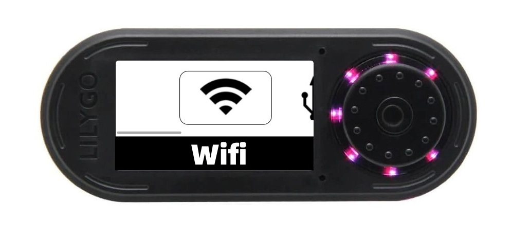
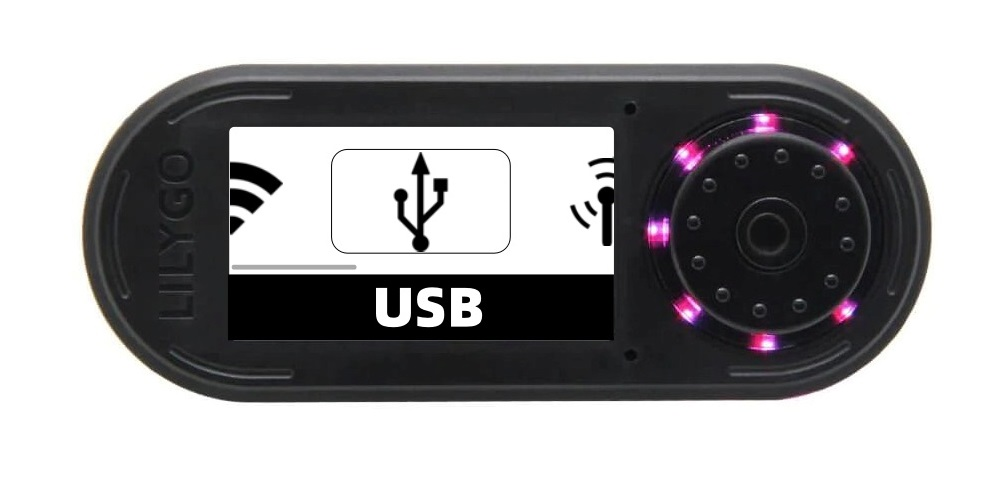

# Fapper Zero Firmware  HUN73R.0047

<strong>Firmware designed and developed by</strong> David Miguel (HUN73R.0047) (https://github.com/DMFSouza).

  
<strong>If you enjoyed this project, consider buying me a coffee:</strong>
  

   
<strong>If you're Brazilian, consider using Pix key:</strong>
  

 
</ul>
 
 

# Summary

<li><strong><a href="#installation">Installation</a></strong></li>
<ul>
<li><a href="#sdfiles">1)SD files</a></li>
<li><a href="#lib">2)Lib files</a></li>
<li><a href="#ide">3)Arduino IDE Config</a></li>

</ul>

<li><strong><a href="#wifi">Wifi Mode</a></strong></li>

<li><strong><a href="#usb">Usb Mode</a></strong></li>

<li><strong><a href="#rf">RF Mode</a></strong></li>

<li><strong><a href="#sd">SD Logs</a></strong></li>

<li><strong><a href="#disclaimer">Disclaimer</a></strong></li>

# Introduction
This code aims to be an Open Source alternative to the Flipper Zero. It is based on the LilyGo ESP32 S3 hardware, T-Embed model, but it can be adapted to other ESP32 models as well. The idea is to create an affordable alternative to the Flipper, which faces various legal restrictions in many countries. And why this name? Well, because I found it amusing.

# Installation

## 1) SD Files
- Download everything from the 'SD_CARD' folder and place it on a MicroSD card.

## 2) Lib Files
- This code uses several libraries that I had to modify manually. Therefore, for its correct operation, it is necessary to use the libraries available in the Lib folder of this repository.
  
## 3) Arduino IDE Config
<li> This project uses the esp32fs plugin. Please note that Arduino IDE version 2.x does not support the esp32fs plugin. Use Arduino 1.18.x to upload resource files.</li>
 
<li> Please refer to the following figure for specific options</li>
  

  </a>

  

# Wifi Mode

  </a>

# Usb Mode

  </a>

# RF Mode

  </a>

# SD Logs

  </a>

# Disclaimer

Fapper Zero is a basic device for professionals and cybersecurity enthusiasts.

We are not responsible for the incorrect use of Fapper Zero.

Be careful with this device and the transmission of signals. Make sure to follow the laws that apply to your country.
